## 燕山人的旧时光
燕山老物件，如有心仪，请记下编号，页面最下方有购买联系方式。

---

### 编号0001. 东炼专属胸牌
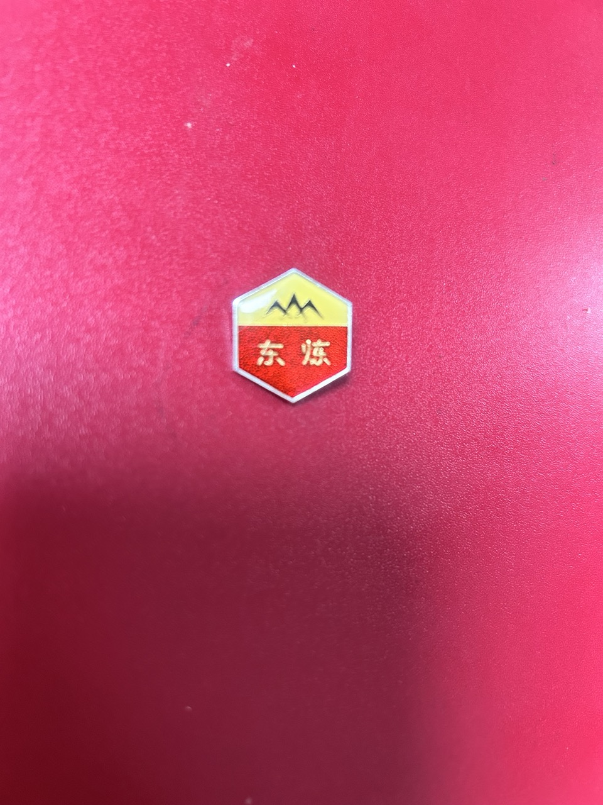
* **简介**：东炼（东方红炼油厂）特定历史时期胸牌，细节精美。
* **成色**：原漆完好，10成新
* **价格**：50（或以其他纪念品交换）

---

### 编号0002. 接待中心文创卡（2009版）

* **简介**：接待中心已经改名为燕化宾馆，这个纪念物可以收藏,制作很精美，文化气息十足。
* **成色**：六成新
* **价格**：10（或以其他纪念品交换）

---

### 编号0003. 燕山纪念胸牌YSPC
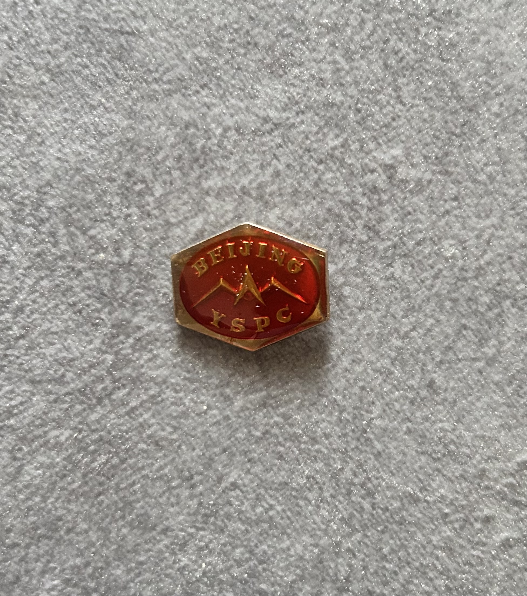
* **简介**：经典燕山胸牌，那个年代身份与荣耀的象征，收藏价值极高。
* **成色**：十成新
* **价格**：50（或以其他纪念品交换）

---

### 编号0004. 燕山风景明信片
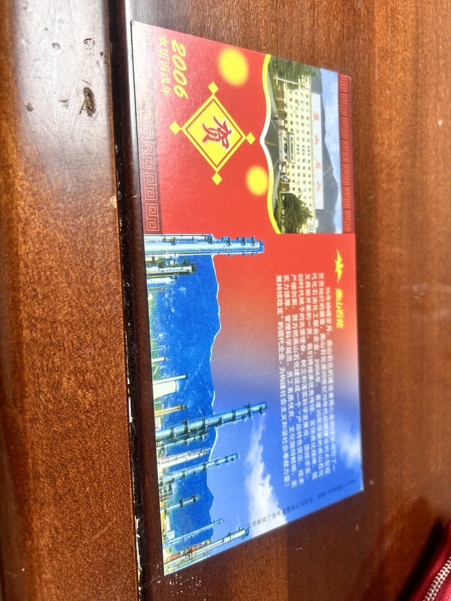
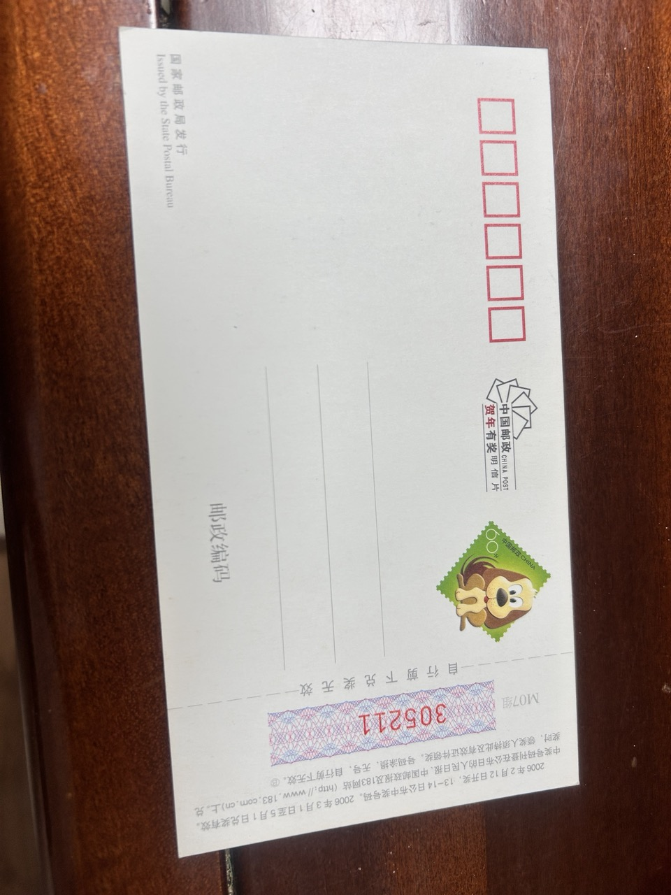
* **简介**：精美印刷的明信片，记录了燕山代表性的装置建筑与景观。
* **成色**：全新未书写
* **价格**：5（或以其他纪念品交换）

---

### 编号0005. “一帆风顺”钥匙扣
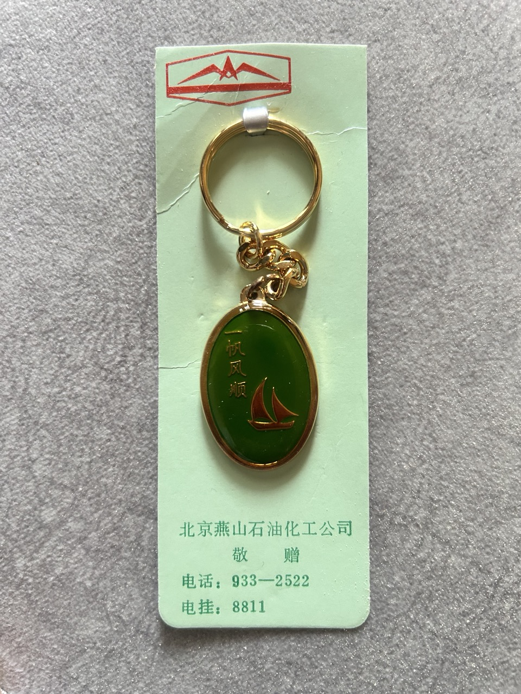
* **简介**：寓意美好，金属质感扎实，是燕山老物件中的经典款。
* **成色**：10成新
* **价格**：40（或以其他纪念品交换）

---

### 编号0006. 燕山钥匙牌（圆型）
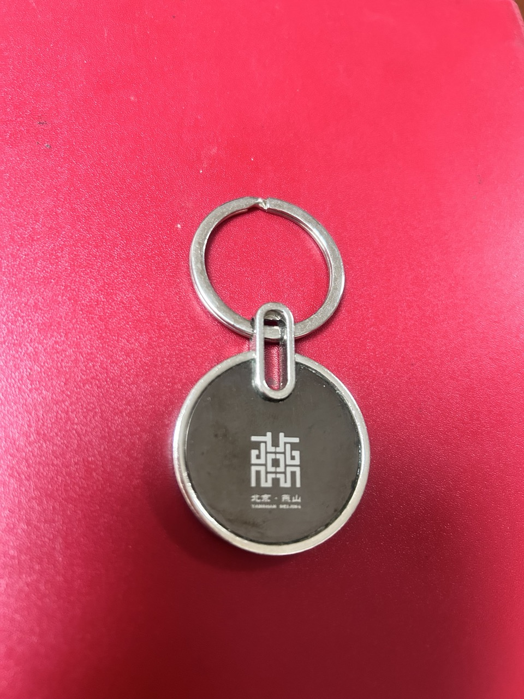
* **简介**：带有燕山标志性 Logo 的圆形钥匙牌，小巧精致。
* **成色**：七成新
* **价格**：30（或以其他纪念品交换）

---

### 编号0007. 燕山钥匙牌（长方形）
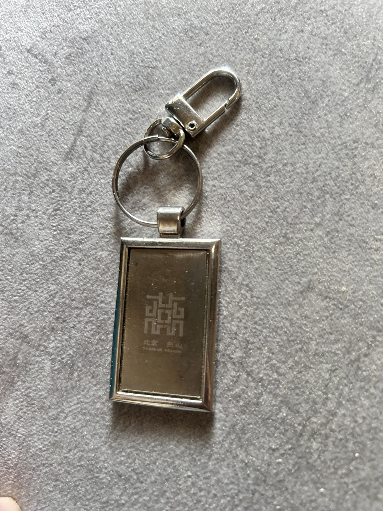
* **简介**：长方形设计，手感厚实，正面刻印清晰。
* **成色**：七成新
* **价格**：15（或以其他纪念品交换）

---

### 编号0008. 塑料分公司钥匙牌
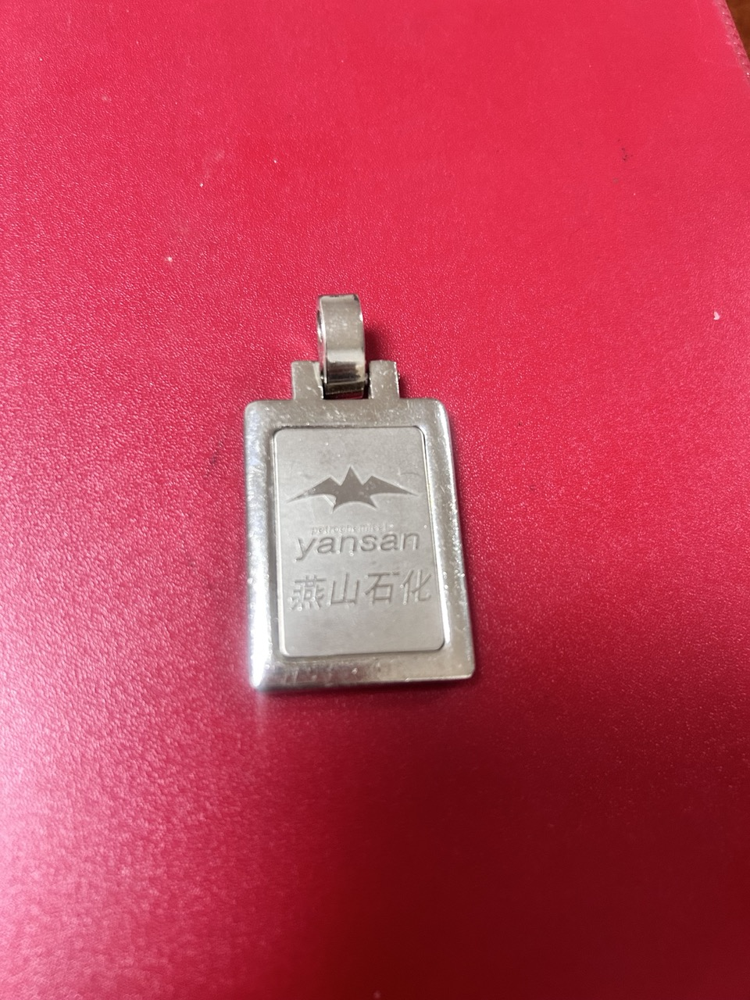
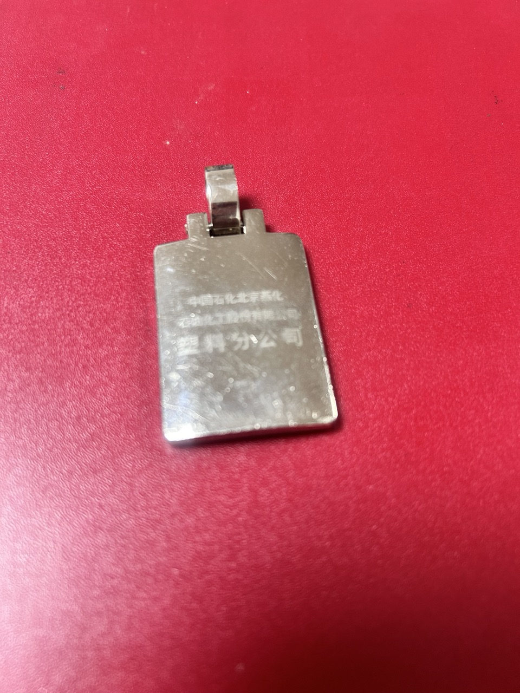
* **简介**：具有特定历史意义的单位定制物件，存世量相对较少。
* **成色**：6成新
* **价格**：25（或以其他纪念品交换）

---

### 编号0009. 燕山笔记本
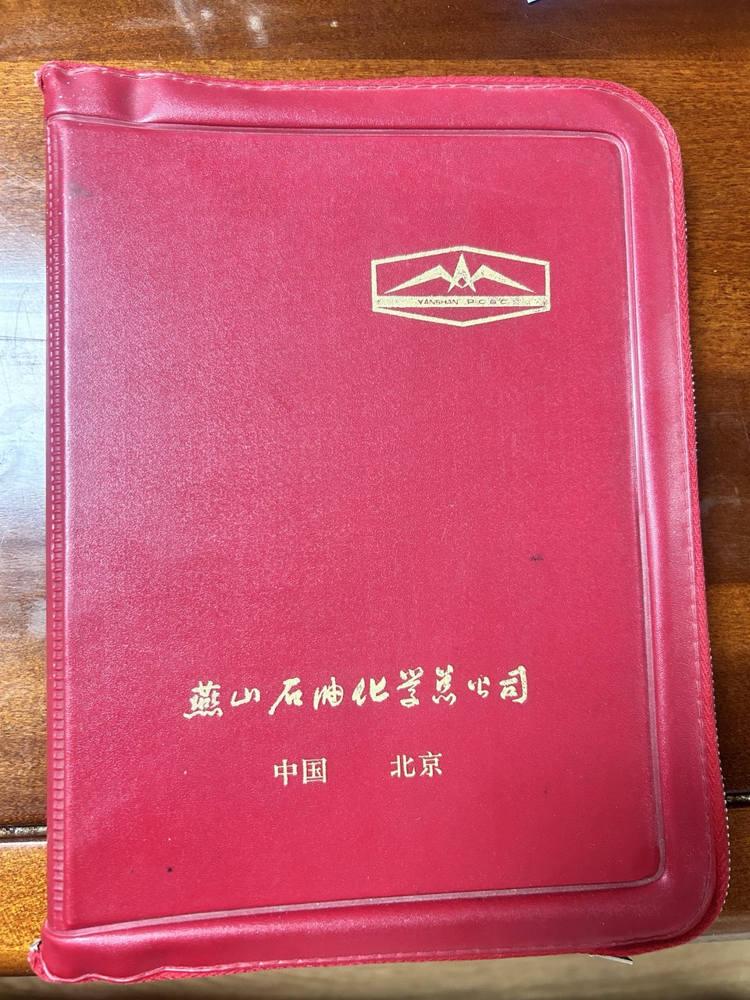
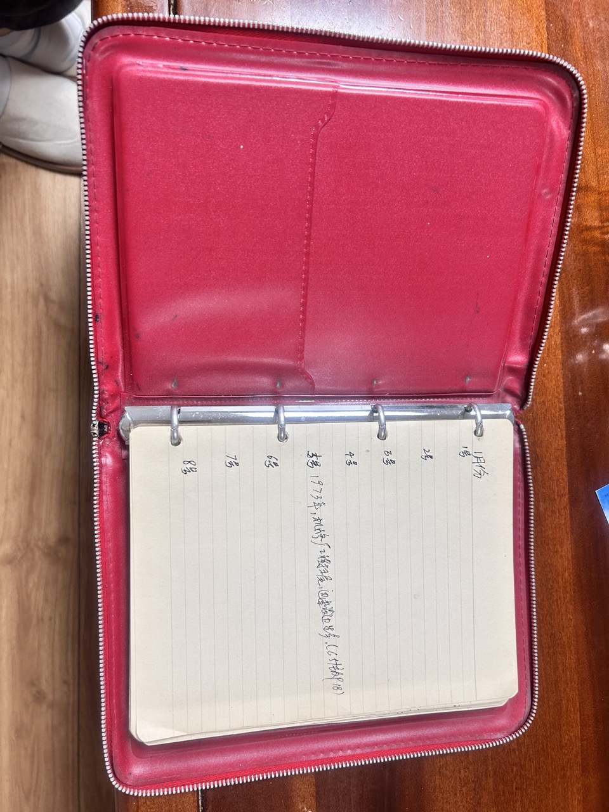
* **简介**：封面印有：燕山石油化学总公司，内页泛黄，有字迹，极具历史厚重感。
* **成色**：8成新
* **价格**：40（或以其他纪念品交换）

---

### 编号0010. 公司机关纪念品

* **简介**：外观全新，但是时钟已经不走了，定格在了那个充满阳光的下午1：10。
* **成色**：9.5成新
* **价格**：70（或以其他纪念品交换）

---

### 📦 购买联系方式
* **微信号**：BloodyForestlin
* **备注**：请说明来自“燕山旧物”页面，并说明心仪的老物件编号。
